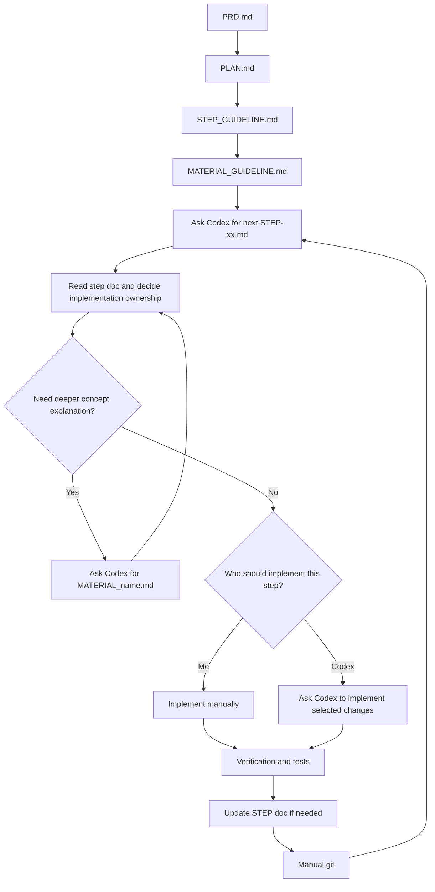
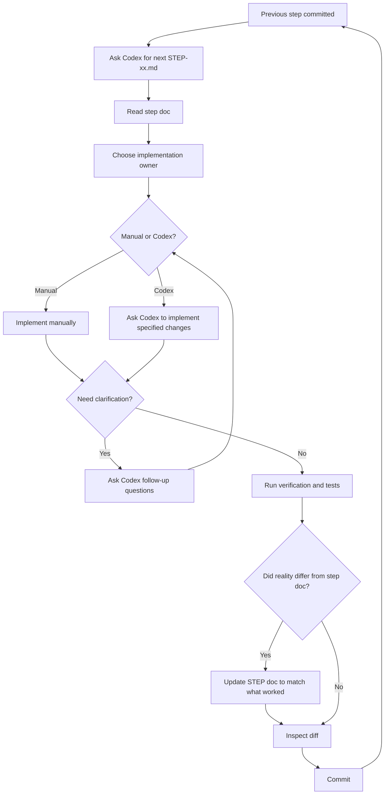
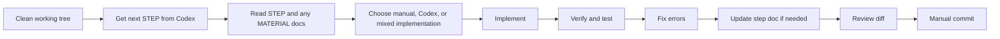

# Development Workflow

This document explains the development workflow used to build Rahasia.

It is not just a list of tools. It is a way of turning an app idea into:

- a product definition
- a sequence of small implementation steps
- reusable concept notes
- disciplined commits
- a training loop for getting better at software development while using AI

In this project, the AI tool used for that workflow is **Codex**.

## Why This Workflow Exists

The main goal is not "type less code."

The main goal is:

- keep the project understandable
- keep scope under control
- build correct mental models
- use AI as leverage without giving up engineering judgment

A rough industry pattern right now is:

- stronger developers can "vibe code" more safely because they already have better technical judgment
- weaker developers can get stuck faster because they cannot yet tell good output from bad output

So the answer is not "avoid AI."

The answer is:

- build the underlying skill
- use AI to accelerate that skill-building
- use AI to explain, structure, draft, and review
- do not outsource judgment

This workflow is designed around that idea.

## Core Principles

### 1. Product first, code second

Before building anything, define what the product is, what it is not, and what the first version must actually do.

### 2. One logical step at a time

Do not ask AI or yourself to build the entire app in one shot.

Break the work into steps that are:

- small enough to verify
- large enough to matter
- narrow enough to commit cleanly

### 3. Explain the why, not only the how

Implementation checklists are useful, but they are not enough.

For unfamiliar concepts, create separate material docs that explain:

- what the concept is
- why it exists
- how it fits this project
- what can go wrong

### 4. Verification is part of the step

A step is not done when code exists.

A step is done when you can verify:

- the code runs
- the behavior matches the intended scope
- the diff is coherent
- the commit message matches reality

### 5. Use AI to upskill

Both junior and senior developers now use AI heavily. That is normal.

The useful question is not whether to use AI. The useful question is how.

Use AI to:

- turn vague ideas into concrete steps
- explain concepts at the right depth
- draft code you can inspect
- generate verification checklists
- challenge weak assumptions

Do not use AI as an excuse to skip:

- reading the code
- understanding dependencies
- verifying runtime behavior
- learning the underlying tools

## Document Order

This workflow starts with docs before implementation.

The usual order is:

1. `devlog/PRD.md`
2. `devlog/PLAN.md`
3. `devlog/STEP_GUIDELINE.md`
4. `devlog/MATERIAL_GUIDELINE.md`
5. the next `devlog/STEP-xx.md` file, created when needed in Codex
6. `devlog/MATERIAL_*.md` files as needed during implementation

Each document has a different role.



## 1. Start With The PRD

File:

- `devlog/PRD.md`

Purpose:

- define the product
- define goals and non-goals
- define the main user flows
- define the core technical direction

The PRD should answer:

- what problem this app solves
- who it is for
- what v1 includes
- what v1 intentionally does not include
- what rules must remain true

In Rahasia, this is where the core security rule was made explicit:

- the backend must not store readable plaintext content

That kind of rule matters because it shapes later implementation decisions.

If the PRD is vague, the whole build becomes vague.

Tip:

- write the PRD before choosing too many tools
- define the product constraints first, then choose the stack that serves those constraints

Starter prompt:

```text
Help me write a PRD for a small full-stack app.
I want the PRD to include overview, goals, non-goals, target users, MVP scope,
user flows, product rules, and technical direction.
Keep it concrete and scoped for a first real version.
```

## 2. Turn The PRD Into A Plan

File:

- `devlog/PLAN.md`

Purpose:

- translate the product into build order
- choose the repo shape
- split implementation into logical steps
- define commit-sized milestones

The plan should not just say "build frontend" or "build backend."

It should say things like:

- initialize monorepo structure
- scaffold frontend
- scaffold backend
- add local database
- add migrations
- create first model
- implement create endpoint
- implement retrieval endpoint
- add frontend flow
- add encryption
- add lifecycle rules
- add tests
- add public docs

That sequence matters.

A good plan reduces confusion because at any moment you know:

- what has already been solved
- what the current step is
- what is intentionally not being done yet

Tip:

- each planned step should end in a believable commit
- if a step cannot be explained in one commit message, it is probably too big

Starter prompt:

```text
Based on this PRD, create a step-by-step implementation plan for a monorepo.
Each step should be one logical commit, build on previous steps, and keep scope
tight. Include suggested commit messages.
```

## 3. Define How Step Docs Should Work

File:

- `devlog/STEP_GUIDELINE.md`

Purpose:

- standardize how implementation steps are written
- force each step to teach and verify, not just instruct

This matters because once the project gets larger, random notes become messy fast.

The step guideline in this repo establishes a pattern:

1. Goal
2. Starting Point
3. Do This
4. Expected Result
5. What Not To Do Yet
6. Verification
7. Finish This Step

That structure is strong because it gives every step:

- a purpose
- a boundary
- a known starting state
- concrete commands or code
- a success check
- a commit finish line

Tip:

- if you cannot write "what not to do yet," the step boundary is probably weak
- scope control is one of the biggest benefits of this method

Starter prompt:

```text
Write a guideline for implementation step documents in this project.
The guideline should force each step to include goal, starting point, numbered
substeps, verification, out-of-scope notes, and an exact commit message.
Write it like a pragmatic mentor.
```

## 4. Define How Material Docs Should Work

File:

- `devlog/MATERIAL_GUIDELINE.md`

Purpose:

- separate conceptual understanding from execution steps

This is one of the most important parts of the workflow.

Without it, step docs become bloated with theory, or material gets lost entirely.

In this repo:

- `STEP-*` docs explain what to do next
- `MATERIAL_*` docs explain why the underlying concept exists and how it works

That separation keeps both doc types useful.

Tip:

- if a concept is unfamiliar enough that you would otherwise keep reopening docs
  or asking the same AI question, it deserves a material doc

Starter prompt:

```text
Write a guideline for MATERIAL docs in this project.
They should explain first principles, mental models, tradeoffs, alternatives,
and project-specific usage. These are reference docs, not checklists.
```

## 5. Create Step Docs One By One In Codex

Files:

- `devlog/STEP-01.md`
- `devlog/STEP-02.md`
- `devlog/STEP-03.md`
- ...

These step docs are **not** written all at once immediately after `PLAN.md`.

They are created one by one.

The working pattern is:

1. complete the current step
2. verify it locally
3. commit it manually with Git
4. ask Codex to generate the next `STEP-xx.md`
5. read that step doc like a just-in-time tutorial
6. decide whether this step is something you want to implement yourself or delegate to Codex
7. implement the changes manually for the parts you want hands-on practice with
8. ask Codex to implement the parts or steps you do not need to practice manually
9. ask Codex questions if anything in the step is unclear
10. run the verification commands and tests
11. update the step doc if reality differs from the original draft
12. commit the completed step manually

This makes each step doc a generate-on-the-fly tutorial rather than a giant prewritten course.

That is important because once the codebase changes, the next step can be written against the actual current state instead of an older guess.

It also means implementation ownership can vary by step.

For example:

- if the current learning goal is backend work, you may implement backend changes manually
- if the frontend is only needed to prove the backend works, you may ask Codex to implement larger frontend changes for you
- small surrounding tasks such as commands, setup, or tiny edits may still be done manually even in areas that are not your focus

The key rule is:

- the step doc still comes first
- then you explicitly decide who should implement that step or part of that step



The step doc should be specific enough to include:

- exact file paths
- exact commands
- exact code when needed
- expected outputs
- what success should look like

That makes the doc useful in two ways:

- it guides the implementation now
- it becomes a reusable record of how the project was built

In practice, the doc is allowed to evolve during the step.

Sometimes:

- a command does not work as originally written
- a file path has changed
- a small implementation detail turns out to be wrong
- tests expose a missing edge case

When that happens, the step doc should be corrected after the implementation and test pass, so it reflects what actually worked.

Tip:

- treat the step doc as the interface between planning and code
- if the doc is sloppy, the implementation usually becomes sloppy too

Starter prompt:

```text
Write STEP-06 for this project.
The goal is to add the first real SQLAlchemy model and migration.
Use this structure: goal, starting point, numbered substeps, verification,
what not to do yet, and finish-this-step commit instructions.
Explain each important substep before showing commands or code.
```

## 6. Create Material Docs On Demand In Codex When A Step Hits A Conceptual Wall

Files in this repo include:

- `devlog/MATERIAL_ALEMBIC.md`
- `devlog/MATERIAL_SQLALCHEMY_MODEL.md`
- `devlog/MATERIAL_WEB_CRYPTO.md`
- `devlog/MATERIAL_SESSION_AND_YIELD.md`
- `devlog/MATERIAL_PYDANTIC_VS_SQLALCHEMY.md`

Do not create material docs for everything.

Create one when:

- the concept is central to the project
- the concept is easy to misuse
- the concept has multiple layers or tradeoffs
- the step doc would become too cluttered if it explained all the background
- you want a reference you can reuse in later steps

Examples:

- Alembic deserves a material doc because migrations are foundational and easy to misunderstand
- Web Crypto deserves a material doc because it is core to the product claim
- SQLAlchemy model boundaries deserve a material doc because model/schema confusion is common

Good timing:

- before a step, if you know the concept is unfamiliar
- during a step, if you realize you do not actually understand the abstraction
- after a step, if you want to distill the lesson while it is still fresh

In this workflow, the trigger is usually practical:

- while reading the current `STEP-xx.md`, you realize you do not fully understand a concept
- while implementing manually, you hit a conceptual gap
- while debugging a failure, you realize the missing knowledge deserves its own note

At that point, ask Codex to write `MATERIAL-<name>.md`.

Then use that material doc as a reference while continuing the current step.

Tip:

- write the material doc at the moment confusion appears, not three weeks later
- your future self will need the answer at exactly the same point again

Starter prompt:

```text
Write a MATERIAL doc for Web Crypto in this project.
Explain first principles, why the browser does encryption instead of the backend,
how AES-GCM fits here, what the server should and should not know, and common
mistakes to avoid. Keep it grounded in this app, not generic theory.
```

## 7. Implement In Tight Loops

Once the docs exist, the coding loop is simple:

1. start from a clean working tree
2. confirm the previous step is committed manually
3. ask Codex for the next `STEP-xx.md`
4. read the current `STEP-xx.md`
5. read any related `MATERIAL_*.md`
6. decide whether the current step should be implemented manually, by Codex, or as a mix
7. implement the parts you want hands-on practice with
8. ask Codex to implement the parts you want delegated
9. ask Codex questions when needed
10. run the verification commands from the step
11. fix errors found during implementation or testing
12. update the step doc if needed so it matches the real working solution
13. inspect the diff
14. commit manually with the planned message

This is intentionally boring.

That is a good sign.

The workflow is designed to remove drama from development.



Tip:

- when a step starts growing sideways, stop and split it
- do not "just add one more thing" because that is how clean learning loops break

## 8. Keep One Commit Per Step

This repo's step docs usually end with an exact commit message for a reason.

Benefits:

- each commit tells a coherent story
- regressions are easier to trace
- later review is easier
- learning is easier because each change has a clear purpose

This also works well with AI because it gives the assistant a tighter target.

Bad target:

- "build the rest of the app"

Good target:

- "implement share retrieval API"
- "add browser-side text encryption"
- "add API and frontend tests"

Tip:

- if your diff touches too many unrelated concepts, the step probably drifted

Starter prompt:

```text
Review this step and tell me whether the scope still matches the planned commit.
If it is too broad, suggest how to split it into two cleaner steps.
```

## 9. Use Verification As A First-Class Habit

Every step should include verification commands.

That is not documentation filler. It is part of the method.

Verification can include:

- running the app
- hitting a health endpoint
- checking generated files
- inspecting migration output
- testing one API route
- checking frontend behavior manually
- running automated tests
- reviewing `git diff`

This matters because AI-generated code can look plausible while still being wrong.

You need reality checks.

Tip:

- ask for expected output shape, not just commands
- "what should I see if this worked?" is a very strong question

Starter prompt:

```text
For this step, give me a verification section with exact commands, expected output
shape, and what success should look like. Assume I want to catch mistakes early.
```

## 10. Add Tooling Follow-Up Steps When Needed

Not every useful step is a product feature step.

For example, `devlog/STEP-11A-PRETTIER.md` is a workflow-quality step.

That is a good pattern.

Sometimes you discover:

- formatting drift
- missing lint setup
- weak test tooling
- docs lagging behind the code

When that happens, it is often better to create a small follow-up step than to
smuggle the change into a feature step.

Tip:

- workflow improvements deserve clean commits too
- do not hide tooling changes inside unrelated feature diffs

## 11. Use Codex As Mentor, Drafter, Reviewer, And Rubber Duck

The most effective Codex usage pattern here is not "generate the entire app."

It is closer to this:

- ask Codex to structure the work
- ask Codex to explain the concept
- ask Codex to draft the next step
- ask Codex to draft or refine code for that step
- ask Codex to fully implement selected steps when those steps are not the current learning target
- ask Codex to suggest verification
- ask Codex to review whether the step actually matches the intended boundary
- ask Codex to write a material doc when a concept deserves one

That means Codex plays multiple roles:

- planner
- teacher
- pair programmer
- reviewer

But the human still owns:

- scope decisions
- final judgment
- runtime verification
- product tradeoffs
- the actual manual Git commit flow in this project
- deciding which areas to practice manually and which areas to delegate to Codex

Tip:

- if Codex gives correct code but you cannot explain why it is correct, slow down
- the point is not just to finish the file, it is to improve your internal model

## 12. How This Workflow Trains Skill Instead Of Replacing It

This method is intentionally educational.

It helps build skill because it forces you to practice:

- decomposition
- sequencing
- naming
- architecture boundaries
- verification habits
- commit discipline
- concept learning

That is why it works especially well if you are still growing into stronger engineering judgment.

It is also flexible.

You do not need to manually implement every layer of the product to benefit from the method.

A practical example:

- you may be actively learning backend architecture in one session
- the frontend may only be needed as proof that the backend behavior is wired correctly
- in that situation, it is reasonable to ask Codex to implement the larger frontend changes after the step doc is written

That still fits the workflow because:

- the scope is still defined by the step doc
- you still review what changed
- you still run verification and tests
- you still keep the learning focus where you want it

A senior engineer often moves faster with AI because they already know:

- what a good boundary looks like
- what failure modes to expect
- which abstractions are dangerous
- when code is merely plausible instead of correct

If you are not there yet, the answer is not to avoid AI.

The answer is to use AI in a way that trains those exact muscles.

This workflow does that by forcing repeated practice in:

- defining scope
- explaining concepts
- verifying behavior
- keeping steps small enough to understand

## Practical Tips And Tricks

- Write the PRD in plain language first. Fancy wording does not improve clarity.
- Keep non-goals explicit. They prevent accidental overbuilding.
- Prefer steps that can be verified in under an hour.
- When a concept feels slippery, pause and write a material doc before coding more.
- Ask for exact file paths and command sequences. Vagueness creates drift.
- Ask AI for "what could go wrong" sections. They are often more valuable than the happy path.
- Put expected output in docs whenever a command matters.
- Review the diff before every commit, especially after copying generated code.
- If formatting or tooling problems appear, create a small follow-up step instead of mixing concerns.
- Use docs to compress future confusion. If you had to figure something out twice, document it.

## Example End-To-End Flow

Here is the typical sequence in this project:

1. Write `devlog/PRD.md`.
2. Write `devlog/PLAN.md`.
3. Write doc guidelines for steps and materials.
4. Ask Codex to generate `STEP-01`.
5. Implement `STEP-01` manually or ask Codex to implement it, depending on the learning goal.
6. Verify it and commit it manually.
7. Ask Codex to generate `STEP-02`.
8. Decide whether `STEP-02` should be implemented by you, by Codex, or in a mixed way.
9. Read it like a tutorial even if Codex will implement parts of it.
10. Ask Codex questions if the step needs clarification.
11. If a concept deserves durable explanation, ask Codex for a `MATERIAL_*` doc.
12. Run verification and tests.
13. If the step doc needs correction based on real implementation, update it.
14. Commit manually.
15. Repeat for the next step.

The point is not that every project must use these exact file names.

The point is the pattern:

- define
- decompose
- explain
- implement
- verify
- commit
- repeat

## Starter Prompt Pack

These are reusable prompt templates for this workflow.

### Turn An Idea Into A PRD

```text
I want to build a small full-stack app. Help me write a PRD that includes:
overview, product goal, non-goals, target users, MVP scope, user flows,
functional requirements, technical direction, and explicit product rules.
Keep the scope realistic for a first version.
```

### Turn A PRD Into A Build Plan

```text
Based on this PRD, break implementation into ordered steps.
Each step should be one logical commit, with a short description of what it adds
and what remains out of scope.
```

### Write A Step Doc

```text
Write STEP-08 for this project.
Use this structure: goal, starting point, do this, expected result,
what not to do yet, verification, and finish-this-step commit instructions.
Explain the purpose of each substep before giving commands or code.
Assume I will implement it manually after reading it.
```

### Write A Material Doc

```text
Write a MATERIAL doc for this concept as used in this project.
Start from first principles, explain why it exists, how it fits this app,
alternatives, failure modes, and the practical rule I should follow.
```

### Review Scope Drift

```text
Here is the current step doc and my current diff.
Tell me whether the implementation still matches the planned scope.
Point out drift, hidden extra work, and what should be postponed.
```

### Generate Verification

```text
Give me a verification section for this step.
Include exact commands, expected output shape, and what success should look like.
Assume I want to catch mistakes before committing.
```

### Ask For Teaching, Not Just Output

```text
Do not just give me the final code.
Explain what this layer is responsible for, what it depends on, common mistakes,
and then give me the code.
```

### Ask For A Tutorial-Style Next Step

```text
I just finished and manually committed Step 7.
Now write STEP-08 for the current repo state.
Make it detailed enough that I can follow it like a generate-on-the-fly tutorial.
Include exact commands, what to expect, and what not to do yet.
```

### Ask Codex To Implement A Supporting Step

```text
I want the STEP doc first, but I do not need hands-on practice implementing this
frontend part myself.
After writing the STEP doc, implement the frontend changes for this step in the
codebase, and keep the implementation scoped to the step.
```

### Ask Codex To Implement Only Part Of A Step

```text
Write the next STEP doc first.
I want to implement the backend changes manually because that is the learning
goal for this session, but I want you to implement the frontend changes after
that. Keep both parts aligned with the same step.
```

### Ask For A Material Doc Mid-Step

```text
I am implementing the current step manually and I realized I do not understand
Alembic autogenerate well enough.
Write `MATERIAL_ALEMBIC.md` for this project: first principles, why we need it,
how it fits this repo, common failure modes, and practical rules.
```

### Ask For A Step Update After Real-World Errors

```text
I followed the current STEP doc, but I hit errors and had to adjust the code.
Here is what actually worked. Update the STEP doc so it reflects the real
implementation and verification path, not the earlier draft.
```

## Final Thought

This workflow is deliberately structured.

That structure is not bureaucracy. It is leverage.

The more AI improves, the more important it becomes to know:

- how to define a problem clearly
- how to split work into good boundaries
- how to verify results
- how to tell whether code is actually sound

If you use AI to strengthen those abilities, it becomes an accelerator.

If you use AI to skip those abilities, it becomes a crutch.

This workflow tries to push in the first direction.
