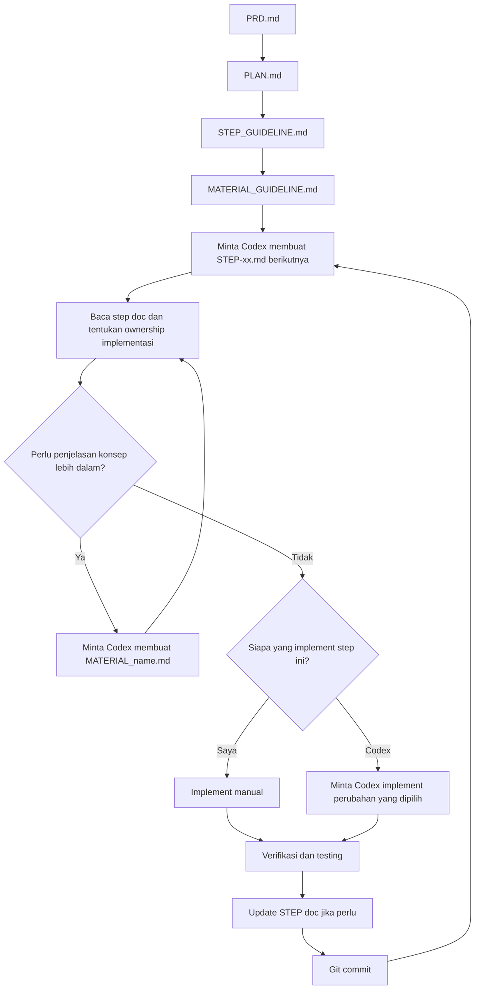
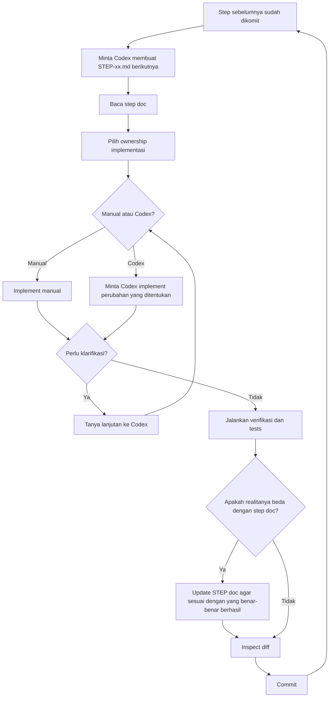
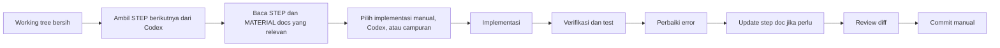

# Workflow Pengembangan

Dokumen ini menjelaskan workflow pengembangan yang dipakai untuk membangun Rahasia.

Ini bukan cuma daftar tools. Ini adalah cara untuk mengubah ide aplikasi menjadi:

- definisi produk
- rangkaian langkah implementasi kecil
- catatan konsep yang bisa dipakai ulang
- commit yang disiplin
- loop latihan untuk jadi lebih baik dalam software development sambil memakai AI

Di project ini, tool AI yang dipakai dalam workflow tersebut adalah **Codex**.

## Kenapa Workflow Ini Ada

Tujuan utamanya bukan "biar ngetik kode lebih sedikit."

Tujuan utamanya adalah:

- menjaga project tetap mudah dipahami
- menjaga scope tetap terkendali
- membangun mental model yang benar
- memakai AI sebagai leverage tanpa menyerahkan judgment engineering

Pola kasar yang kelihatan di industri saat ini:

- developer yang lebih kuat bisa "vibe code" dengan lebih aman karena technical judgment mereka sudah lebih matang
- developer yang lebih lemah lebih gampang tersesat karena belum bisa membedakan output yang bagus dan yang jelek

Jadi jawabannya bukan "hindari AI."

Jawabannya adalah:

- bangun skill dasarnya
- pakai AI untuk mempercepat proses membangun skill itu
- pakai AI untuk menjelaskan, menyusun, menyusun draft, dan mereview
- jangan outsource judgment

Workflow ini didesain berdasarkan ide itu.

## Prinsip Inti

### 1. Produk dulu, kode belakangan

Sebelum membangun apa pun, definisikan dulu produknya apa, bukan apa, dan versi pertama harus benar-benar bisa melakukan apa.

### 2. Satu langkah logis dalam satu waktu

Jangan minta AI atau diri sendiri membangun seluruh aplikasi sekaligus dalam satu tembakan.

Pecah pekerjaan menjadi langkah-langkah yang:

- cukup kecil untuk diverifikasi
- cukup besar untuk berarti
- cukup sempit untuk dikomit dengan rapi

### 3. Jelaskan kenapa, bukan cuma bagaimana

Checklist implementasi itu berguna, tapi tidak cukup.

Untuk konsep yang masih asing, buat dokumen material terpisah yang menjelaskan:

- konsep ini sebenarnya apa
- kenapa konsep itu ada
- bagaimana konsep itu masuk ke project ini
- apa yang bisa salah

### 4. Verifikasi adalah bagian dari step

Sebuah step belum selesai hanya karena kodenya sudah ada.

Sebuah step selesai ketika kamu bisa memverifikasi:

- kodenya jalan
- behavior-nya sesuai scope yang dimaksud
- diff-nya koheren
- commit message-nya sesuai kenyataan

### 5. Pakai AI untuk upskill

Baik junior maupun senior sekarang sama-sama banyak memakai AI. Itu normal.

Pertanyaan yang berguna bukan apakah memakai AI atau tidak. Pertanyaannya adalah bagaimana caranya.

Pakai AI untuk:

- mengubah ide yang masih kabur menjadi langkah konkret
- menjelaskan konsep dengan kedalaman yang pas
- membuat draft kode yang bisa kamu inspeksi
- menghasilkan checklist verifikasi
- menantang asumsi yang lemah

Jangan pakai AI sebagai alasan untuk melewatkan:

- membaca kode
- memahami dependency
- memverifikasi behavior runtime
- mempelajari tool dasarnya

## Urutan Dokumen

Workflow ini dimulai dari dokumen dulu sebelum implementasi.

Urutan umumnya adalah:

1. `devlog/PRD.md`
2. `devlog/PLAN.md`
3. `devlog/STEP_GUIDELINE.md`
4. `devlog/MATERIAL_GUIDELINE.md`
5. file `devlog/STEP-xx.md` berikutnya, dibuat saat dibutuhkan di Codex
6. `devlog/MATERIAL_*.md` sesuai kebutuhan selama implementasi

Setiap dokumen punya peran yang berbeda.



## 1. Mulai Dari PRD

File:

- `devlog/PRD.md`

Tujuan:

- mendefinisikan produk
- mendefinisikan goals dan non-goals
- mendefinisikan user flow utama
- mendefinisikan arah teknis inti

PRD harus menjawab:

- aplikasi ini menyelesaikan masalah apa
- siapa penggunanya
- v1 mencakup apa
- v1 sengaja tidak mencakup apa
- aturan apa yang harus tetap benar

Di Rahasia, di sinilah aturan keamanan inti dibuat eksplisit:

- backend tidak boleh menyimpan plaintext yang bisa dibaca

Aturan seperti ini penting karena akan membentuk keputusan implementasi berikutnya.

Kalau PRD-nya kabur, seluruh proses build juga akan ikut kabur.

Tip:

- tulis PRD sebelum memilih terlalu banyak tool
- definisikan constraint produk dulu, baru pilih stack yang melayani constraint tersebut

Starter prompt:

```text
Help me write a PRD for a small full-stack app.
I want the PRD to include overview, goals, non-goals, target users, MVP scope,
user flows, product rules, and technical direction.
Keep it concrete and scoped for a first real version.
```

## 2. Ubah PRD Menjadi Plan

File:

- `devlog/PLAN.md`

Tujuan:

- menerjemahkan produk menjadi urutan build
- memilih bentuk repo
- memecah implementasi menjadi langkah-langkah logis
- mendefinisikan milestone seukuran commit

Plan tidak boleh cuma bilang "bangun frontend" atau "bangun backend."

Plan harus mengatakan hal-hal seperti:

- inisialisasi struktur monorepo
- scaffold frontend
- scaffold backend
- tambah database lokal
- tambah migration
- buat model pertama
- implement create endpoint
- implement retrieval endpoint
- tambah flow frontend
- tambah encryption
- tambah lifecycle rules
- tambah tests
- tambah public docs

Urutan itu penting.

Plan yang bagus mengurangi kebingungan karena setiap saat kamu tahu:

- apa yang sudah selesai
- step saat ini apa
- apa yang memang belum dikerjakan sekarang

Tip:

- setiap step yang direncanakan seharusnya bisa berakhir pada commit yang masuk akal
- kalau satu step tidak bisa dijelaskan dalam satu commit message, kemungkinan step itu terlalu besar

Starter prompt:

```text
Based on this PRD, create a step-by-step implementation plan for a monorepo.
Each step should be one logical commit, build on previous steps, and keep scope
tight. Include suggested commit messages.
```

## 3. Definisikan Cara Kerja Step Docs

File:

- `devlog/STEP_GUIDELINE.md`

Tujuan:

- menstandarkan cara menulis implementation steps
- memaksa setiap step untuk mengajar dan memverifikasi, bukan cuma memberi instruksi

Ini penting karena begitu project membesar, catatan acak akan cepat berantakan.

Guideline step di repo ini membuat pola berikut:

1. Goal
2. Starting Point
3. Do This
4. Expected Result
5. What Not To Do Yet
6. Verification
7. Finish This Step

Struktur ini kuat karena memberi setiap step:

- tujuan
- batasan
- starting state yang jelas
- command atau kode yang konkret
- success check
- garis finish dalam bentuk commit

Tip:

- kalau kamu tidak bisa menulis "what not to do yet", kemungkinan batas step-nya masih lemah
- kontrol scope adalah salah satu keuntungan terbesar dari metode ini

Starter prompt:

```text
Write a guideline for implementation step documents in this project.
The guideline should force each step to include goal, starting point, numbered
substeps, verification, out-of-scope notes, and an exact commit message.
Write it like a pragmatic mentor.
```

## 4. Definisikan Cara Kerja Material Docs

File:

- `devlog/MATERIAL_GUIDELINE.md`

Tujuan:

- memisahkan pemahaman konseptual dari langkah eksekusi

Ini salah satu bagian terpenting dari workflow.

Tanpa ini, step docs akan bengkak karena teori, atau material penjelasan akan hilang begitu saja.

Di repo ini:

- `STEP-*` docs menjelaskan apa yang harus dikerjakan berikutnya
- `MATERIAL_*` docs menjelaskan kenapa konsep dasarnya ada dan bagaimana cara kerjanya

Pemisahan ini membuat kedua jenis dokumen tetap berguna.

Tip:

- kalau suatu konsep cukup asing sampai kamu harus bolak-balik buka docs atau bertanya hal yang sama ke AI, konsep itu layak punya material doc

Starter prompt:

```text
Write a guideline for MATERIAL docs in this project.
They should explain first principles, mental models, tradeoffs, alternatives,
and project-specific usage. These are reference docs, not checklists.
```

## 5. Buat Step Docs Satu per Satu di Codex

Files:

- `devlog/STEP-01.md`
- `devlog/STEP-02.md`
- `devlog/STEP-03.md`
- ...

Step docs ini **tidak** ditulis sekaligus langsung setelah `PLAN.md`.

Mereka dibuat satu per satu.

Pola kerjanya:

1. selesaikan step saat ini
2. verifikasi secara lokal
3. commit manual dengan Git
4. minta Codex membuat `STEP-xx.md` berikutnya
5. baca step doc itu seperti tutorial just-in-time
6. tentukan apakah step ini ingin kamu implement sendiri atau didelegasikan ke Codex
7. implement perubahan secara manual untuk bagian yang memang ingin kamu latih langsung
8. minta Codex mengimplementasikan bagian atau step yang tidak perlu kamu latih manual
9. tanya Codex kalau ada bagian step yang belum jelas
10. jalankan command verifikasi dan tests
11. update step doc jika realita berbeda dari draft awal
12. commit hasil step tersebut secara manual

Ini membuat setiap step doc terasa seperti tutorial yang dihasilkan saat dibutuhkan, bukan seperti kursus besar yang sudah ditulis dari awal.

Itu penting karena setelah codebase berubah, step berikutnya bisa ditulis berdasarkan kondisi repo yang benar-benar terbaru, bukan tebakan lama.

Ini juga berarti ownership implementasi bisa berbeda-beda di setiap step.

Contohnya:

- kalau learning goal saat ini adalah backend, kamu bisa implement perubahan backend secara manual
- kalau frontend cuma dibutuhkan untuk membuktikan backend bekerja, kamu bisa minta Codex mengimplementasikan perubahan frontend yang lebih besar
- task kecil di sekitarnya seperti command, setup, atau edit kecil tetap bisa dilakukan manual walaupun area itu bukan fokus belajar utama

Aturan kuncinya:

- step doc tetap datang lebih dulu
- lalu kamu secara eksplisit memutuskan siapa yang mengerjakan step itu atau bagian dari step itu



Step doc seharusnya cukup spesifik untuk memuat:

- path file yang tepat
- command yang tepat
- kode konkret bila memang dibutuhkan
- output yang diharapkan
- seperti apa kondisi suksesnya

Ini membuat step doc berguna dalam dua cara:

- membimbing implementasi saat ini
- menjadi catatan yang bisa dipakai ulang tentang bagaimana project ini dibangun

Dalam praktiknya, doc ini boleh berubah selama step berjalan.

Kadang-kadang:

- ada command yang ternyata tidak jalan seperti yang awalnya ditulis
- ada path file yang sudah berubah
- ada detail implementasi kecil yang ternyata salah
- tests membuka edge case yang terlewat

Kalau itu terjadi, step doc sebaiknya diperbaiki setelah implementasi dan test berhasil, supaya isinya merekam apa yang benar-benar worked.

Tip:

- anggap step doc sebagai interface antara planning dan code
- kalau doc-nya berantakan, implementasinya biasanya ikut berantakan

Starter prompt:

```text
Write STEP-06 for this project.
The goal is to add the first real SQLAlchemy model and migration.
Use this structure: goal, starting point, numbered substeps, verification,
what not to do yet, and finish-this-step commit instructions.
Explain each important substep before showing commands or code.
```

## 6. Buat Material Docs Saat Dibutuhkan di Codex Ketika Sebuah Step Menabrak Tembok Konseptual

Files di repo ini misalnya:

- `devlog/MATERIAL_ALEMBIC.md`
- `devlog/MATERIAL_SQLALCHEMY_MODEL.md`
- `devlog/MATERIAL_WEB_CRYPTO.md`
- `devlog/MATERIAL_SESSION_AND_YIELD.md`
- `devlog/MATERIAL_PYDANTIC_VS_SQLALCHEMY.md`

Jangan buat material docs untuk semuanya.

Buat satu ketika:

- konsepnya sentral untuk project
- konsepnya gampang disalahgunakan
- konsepnya punya beberapa layer atau tradeoff
- step doc akan terlalu padat kalau semua background dijelaskan di sana
- kamu ingin punya referensi yang bisa dipakai lagi di step-step berikutnya

Contoh:

- Alembic layak punya material doc karena migration itu foundational dan gampang disalahpahami
- Web Crypto layak punya material doc karena ia inti dari klaim produk ini
- batas model SQLAlchemy layak punya material doc karena kebingungan antara model dan schema itu umum

Timing yang bagus:

- sebelum sebuah step, kalau kamu tahu konsepnya masih asing
- di tengah step, kalau kamu sadar sebenarnya belum paham abstraksinya
- setelah step, kalau ingin mendistilasi pelajaran saat masih segar

Dalam workflow ini, trigger-nya biasanya sangat praktis:

- saat membaca `STEP-xx.md` saat ini, kamu sadar belum benar-benar paham sebuah konsep
- saat implementasi manual, kamu mentok karena ada gap konseptual
- saat debugging error, kamu sadar pengetahuan yang kurang itu pantas punya catatan sendiri

Pada titik itu, minta Codex menulis `MATERIAL-<name>.md`.

Lalu pakai material doc itu sebagai referensi sambil melanjutkan step saat ini.

Tip:

- tulis material doc pada saat kebingungannya muncul, bukan tiga minggu kemudian
- future self kamu biasanya akan butuh jawaban itu di titik yang sama juga

Starter prompt:

```text
Write a MATERIAL doc for Web Crypto in this project.
Explain first principles, why the browser does encryption instead of the backend,
how AES-GCM fits here, what the server should and should not know, and common
mistakes to avoid. Keep it grounded in this app, not generic theory.
```

## 7. Implementasi Dalam Loop Yang Ketat

Setelah dokumennya ada, loop coding-nya sederhana:

1. mulai dari working tree yang bersih
2. pastikan step sebelumnya sudah dikomit manual
3. minta Codex membuat `STEP-xx.md` berikutnya
4. baca `STEP-xx.md` saat ini
5. baca `MATERIAL_*.md` yang relevan jika ada
6. tentukan apakah step saat ini akan diimplementasikan manual, oleh Codex, atau campuran
7. implementasikan bagian yang memang ingin kamu latih langsung
8. minta Codex mengimplementasikan bagian yang ingin kamu delegasikan
9. tanya Codex saat butuh
10. jalankan command verifikasi dari step
11. perbaiki error yang ditemukan selama implementasi atau testing
12. update step doc jika perlu agar sesuai dengan solusi yang benar-benar berjalan
13. inspect diff
14. commit manual dengan message yang direncanakan

Ini sengaja dibuat membosankan.

Itu tanda yang bagus.

Workflow ini didesain untuk menghilangkan drama dari proses development.



Tip:

- kalau sebuah step mulai melebar ke samping, berhenti dan pecah lagi
- jangan "sekalian tambahin satu hal lagi" karena di situlah learning loop yang rapi mulai rusak

## 8. Jaga Satu Commit per Step

Step docs di repo ini biasanya ditutup dengan commit message yang eksplisit karena memang ada alasannya.

Manfaatnya:

- setiap commit menceritakan satu cerita yang koheren
- regression lebih mudah ditelusuri
- review di kemudian hari lebih mudah
- proses belajar juga lebih mudah karena setiap perubahan punya tujuan yang jelas

Ini juga cocok dengan AI karena targetnya jadi lebih sempit.

Target buruk:

- "bangun sisa aplikasinya"

Target bagus:

- "implement share retrieval API"
- "add browser-side text encryption"
- "add API and frontend tests"

Tip:

- kalau diff-mu menyentuh terlalu banyak konsep yang tidak berhubungan, kemungkinan step itu mulai drift

Starter prompt:

```text
Review this step and tell me whether the scope still matches the planned commit.
If it is too broad, suggest how to split it into two cleaner steps.
```

## 9. Jadikan Verifikasi Sebagai Kebiasaan Kelas Satu

Setiap step sebaiknya punya command verifikasi.

Itu bukan filler dokumentasi. Itu bagian dari metodenya.

Verifikasi bisa berupa:

- menjalankan app
- hit endpoint health
- mengecek file yang dihasilkan
- menginspeksi output migration
- mengetes satu API route
- mengecek behavior frontend secara manual
- menjalankan automated tests
- mereview `git diff`

Ini penting karena kode yang dihasilkan AI bisa terlihat masuk akal padahal tetap salah.

Kamu butuh reality check.

Tip:

- minta bentuk output yang diharapkan, bukan cuma command
- pertanyaan "kalau ini berhasil, saya harus melihat apa?" itu pertanyaan yang sangat kuat

Starter prompt:

```text
For this step, give me a verification section with exact commands, expected output
shape, and what success should look like. Assume I want to catch mistakes early.
```

## 10. Tambah Step Follow-Up Tooling Saat Memang Perlu

Tidak semua step yang berguna adalah step fitur produk.

Contohnya, `devlog/STEP-11A-PRETTIER.md` adalah step kualitas workflow.

Itu pola yang bagus.

Kadang kamu menemukan:

- formatting drift
- setup lint yang kurang
- tooling test yang lemah
- docs yang tertinggal dari codebase

Saat itu terjadi, sering kali lebih baik membuat step follow-up kecil daripada menyelundupkan perubahan itu ke dalam step fitur.

Tip:

- improvement workflow juga layak punya commit yang rapi
- jangan sembunyikan perubahan tooling di dalam diff fitur yang tidak terkait

## 11. Pakai Codex Sebagai Mentor, Drafter, Reviewer, dan Rubber Duck

Pola penggunaan Codex yang paling efektif di sini bukan "generate seluruh app."

Lebih mirip seperti ini:

- minta Codex menyusun pekerjaannya
- minta Codex menjelaskan konsepnya
- minta Codex membuat draft step berikutnya
- minta Codex membuat draft atau menyempurnakan kode untuk step itu
- minta Codex mengimplementasikan step tertentu secara penuh ketika step itu bukan learning target saat ini
- minta Codex menyarankan verifikasi
- minta Codex mereview apakah step itu benar-benar masih sesuai boundary yang dimaksud
- minta Codex menulis material doc saat sebuah konsep memang layak punya doc sendiri

Artinya Codex memainkan beberapa peran:

- planner
- teacher
- pair programmer
- reviewer

Tapi manusia tetap memegang:

- keputusan scope
- judgment akhir
- verifikasi runtime
- tradeoff produk
- flow commit Git manual di project ini
- keputusan area mana yang ingin dilatih manual dan area mana yang ingin didelegasikan ke Codex

Tip:

- kalau Codex memberi kode yang tampak benar tapi kamu tidak bisa menjelaskan kenapa itu benar, pelankan dulu
- poinnya bukan cuma menyelesaikan file, tapi memperbaiki internal model-mu

## 12. Bagaimana Workflow Ini Melatih Skill, Bukan Menggantikannya

Metode ini memang sengaja bersifat edukasional.

Ini membantu membangun skill karena memaksamu berlatih:

- decomposition
- sequencing
- naming
- architecture boundaries
- verification habits
- commit discipline
- concept learning

Itulah kenapa metode ini cocok sekali kalau kamu masih sedang menumbuhkan engineering judgment yang lebih kuat.

Metode ini juga fleksibel.

Kamu tidak harus mengimplementasikan setiap layer produk secara manual untuk tetap mendapat manfaat dari metode ini.

Contoh yang praktis:

- kamu mungkin sedang aktif belajar arsitektur backend dalam satu sesi
- frontend mungkin hanya dibutuhkan sebagai bukti bahwa behavior backend sudah terhubung dengan benar
- dalam situasi itu, masuk akal untuk meminta Codex mengimplementasikan perubahan frontend yang lebih besar setelah step doc ditulis

Itu tetap sesuai workflow karena:

- scope-nya tetap ditentukan oleh step doc
- kamu tetap mereview apa yang berubah
- kamu tetap menjalankan verifikasi dan tests
- kamu tetap menjaga fokus belajar di area yang memang ingin kamu latih

Seorang engineer senior sering bergerak lebih cepat dengan AI karena mereka sudah tahu:

- seperti apa boundary yang bagus
- failure mode apa yang harus diwaspadai
- abstraksi mana yang berbahaya
- kapan sebuah kode cuma terlihat masuk akal tapi sebenarnya belum benar

Kalau kamu belum sampai sana, jawabannya bukan menghindari AI.

Jawabannya adalah memakai AI dengan cara yang melatih otot-otot tersebut.

Workflow ini melakukan itu dengan memaksa latihan berulang dalam:

- mendefinisikan scope
- menjelaskan konsep
- memverifikasi behavior
- menjaga step tetap cukup kecil untuk dipahami

## Tips dan Trik Praktis

- Tulis PRD dengan bahasa biasa dulu. Kata-kata yang terlalu mewah tidak otomatis membuatnya lebih jelas.
- Jaga non-goals tetap eksplisit. Mereka mencegah overbuilding secara tidak sengaja.
- Pilih step yang idealnya bisa diverifikasi dalam waktu kurang dari satu jam.
- Saat sebuah konsep terasa licin, pause dan tulis material doc sebelum menulis lebih banyak kode.
- Minta path file dan urutan command yang eksplisit. Hal yang samar biasanya membuat drift.
- Minta AI menulis bagian "what could go wrong". Sering kali itu lebih berharga daripada happy path.
- Tulis expected output setiap kali sebuah command benar-benar penting.
- Review diff sebelum setiap commit, terutama setelah menyalin kode hasil generate.
- Kalau muncul masalah formatting atau tooling, buat step follow-up kecil daripada mencampur concern.
- Pakai docs untuk mengompres kebingungan di masa depan. Kalau kamu harus memecahkan hal yang sama dua kali, dokumentasikan.

## Contoh Alur End-to-End

Berikut urutan tipikal di project ini:

1. Tulis `devlog/PRD.md`.
2. Tulis `devlog/PLAN.md`.
3. Tulis guideline untuk step docs dan material docs.
4. Minta Codex membuat `STEP-01`.
5. Implement `STEP-01` secara manual atau minta Codex mengimplementasikannya, tergantung learning goal.
6. Verifikasi lalu commit secara manual.
7. Minta Codex membuat `STEP-02`.
8. Putuskan apakah `STEP-02` dikerjakan oleh kamu, oleh Codex, atau campuran.
9. Baca step itu seperti tutorial walaupun sebagian implementasinya nanti dikerjakan Codex.
10. Tanya Codex kalau step itu perlu klarifikasi.
11. Kalau sebuah konsep butuh penjelasan yang tahan lama, minta Codex membuat `MATERIAL_*` doc.
12. Jalankan verifikasi dan tests.
13. Kalau step doc perlu dikoreksi berdasarkan implementasi yang benar-benar terjadi, update doc tersebut.
14. Commit manual.
15. Ulangi untuk step berikutnya.

Poinnya bukan setiap project harus memakai nama file yang persis sama.

Poinnya adalah polanya:

- definisikan
- pecah
- jelaskan
- implement
- verifikasi
- commit
- ulangi

## Paket Starter Prompt

Ini adalah template prompt yang bisa dipakai ulang untuk workflow ini.

### Ubah Ide Menjadi PRD

```text
I want to build a small full-stack app. Help me write a PRD that includes:
overview, product goal, non-goals, target users, MVP scope, user flows,
functional requirements, technical direction, and explicit product rules.
Keep the scope realistic for a first version.
```

### Ubah PRD Menjadi Build Plan

```text
Based on this PRD, break implementation into ordered steps.
Each step should be one logical commit, with a short description of what it adds
and what remains out of scope.
```

### Tulis Step Doc

```text
Write STEP-08 for this project.
Use this structure: goal, starting point, do this, expected result,
what not to do yet, verification, and finish-this-step commit instructions.
Explain the purpose of each substep before giving commands or code.
Assume I will implement it manually after reading it.
```

### Tulis Material Doc

```text
Write a MATERIAL doc for this concept as used in this project.
Start from first principles, explain why it exists, how it fits this app,
alternatives, failure modes, and the practical rule I should follow.
```

### Review Scope Drift

```text
Here is the current step doc and my current diff.
Tell me whether the implementation still matches the planned scope.
Point out drift, hidden extra work, and what should be postponed.
```

### Generate Verification

```text
Give me a verification section for this step.
Include exact commands, expected output shape, and what success should look like.
Assume I want to catch mistakes before committing.
```

### Minta Penjelasan, Bukan Cuma Output

```text
Do not just give me the final code.
Explain what this layer is responsible for, what it depends on, common mistakes,
and then give me the code.
```

### Minta Step Berikutnya Bergaya Tutorial

```text
I just finished and manually committed Step 7.
Now write STEP-08 for the current repo state.
Make it detailed enough that I can follow it like a generate-on-the-fly tutorial.
Include exact commands, what to expect, and what not to do yet.
```

### Minta Codex Mengimplementasikan Supporting Step

```text
I want the STEP doc first, but I do not need hands-on practice implementing this
frontend part myself.
After writing the STEP doc, implement the frontend changes for this step in the
codebase, and keep the implementation scoped to the step.
```

### Minta Codex Mengimplementasikan Hanya Sebagian Step

```text
Write the next STEP doc first.
I want to implement the backend changes manually because that is the learning
goal for this session, but I want you to implement the frontend changes after
that. Keep both parts aligned with the same step.
```

### Minta Material Doc di Tengah Step

```text
I am implementing the current step manually and I realized I do not understand
Alembic autogenerate well enough.
Write `MATERIAL_ALEMBIC.md` for this project: first principles, why we need it,
how it fits this repo, common failure modes, and practical rules.
```

### Minta Update Step Setelah Ketemu Error di Dunia Nyata

```text
I followed the current STEP doc, but I hit errors and had to adjust the code.
Here is what actually worked. Update the STEP doc so it reflects the real
implementation and verification path, not the earlier draft.
```

## Penutup

Workflow ini sengaja dibuat terstruktur.

Struktur itu bukan birokrasi. Itu leverage.

Semakin AI membaik, semakin penting untuk tahu:

- bagaimana mendefinisikan masalah dengan jelas
- bagaimana memecah pekerjaan menjadi boundary yang bagus
- bagaimana memverifikasi hasil
- bagaimana membedakan kode yang benar-benar sound dan kode yang cuma terlihat meyakinkan

Kalau kamu memakai AI untuk memperkuat kemampuan-kemampuan itu, AI menjadi akselerator.

Kalau kamu memakai AI untuk melewati kemampuan-kemampuan itu, AI menjadi tongkat.

Workflow ini berusaha mendorong ke arah yang pertama.
